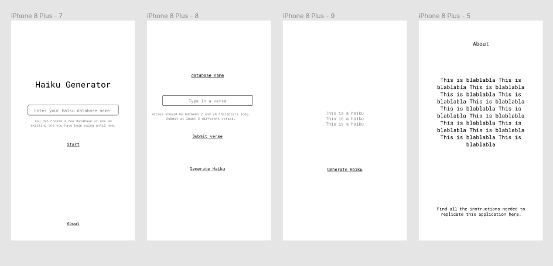

## Haiku-Generator

Haiku-Generator is a simple application created for a client using a MERN stack.

The requierements were to make a generator where users could create their own database, input verses to populate said database and display 3 lines chosen randomly following this design:

## Running the app

Instructions yet to come...
